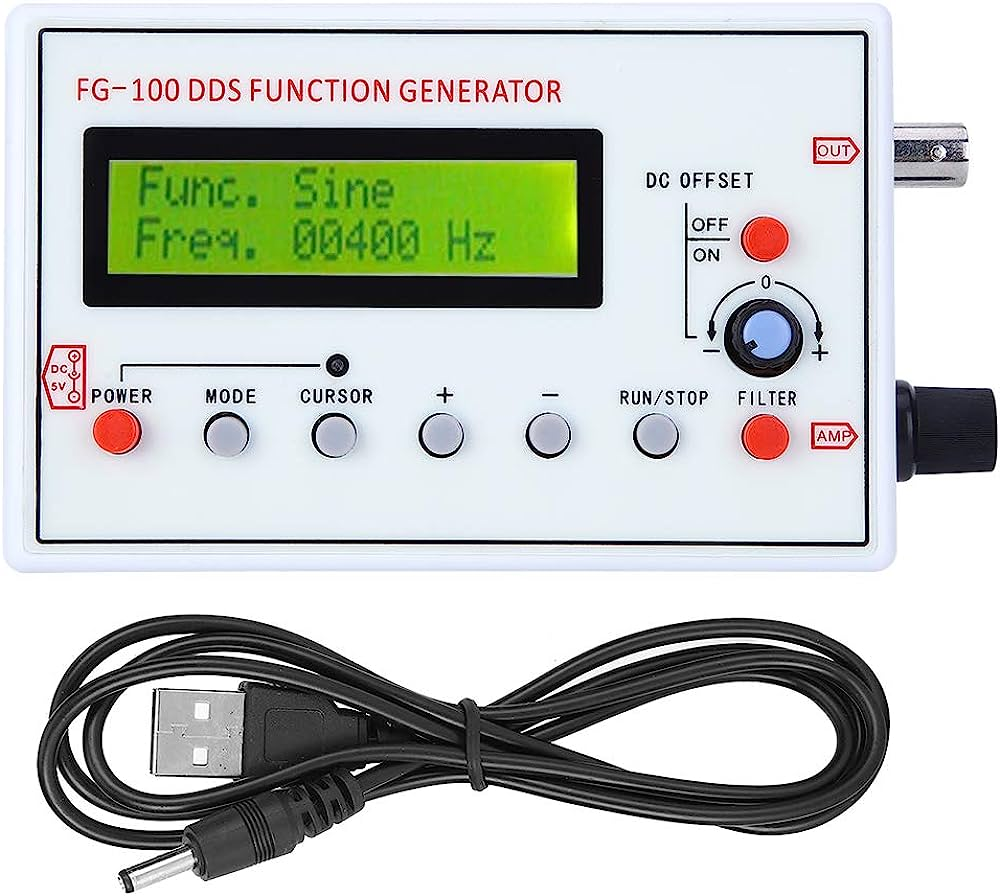
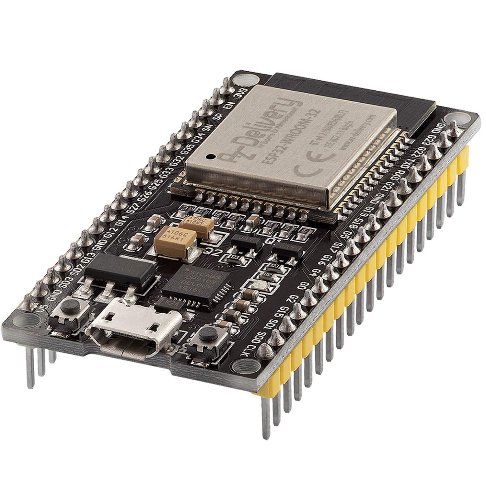
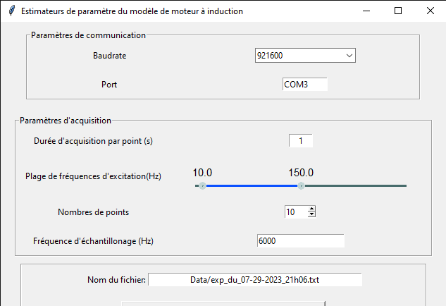

# Analyseur d'impédance faible à faible coût pour la caracterisation de moteurs induction
Développement d'un analyseur d'impédance à faible coût dans le but de caractériser un modèle de moteur à induction.  -  **Low cost developpement of an impedance analyzer for induction motor caracterisation.** ***ENGLISH README comming soon.***

Tous les codes utilisés sont libre d'utilisation.

## Objectif

L'objectif de ce projet est de concevoir un outil permettant de caractériser le modèle du **moteur à induction à double cage d'écureuil** de la moto électrique ***Ambre 125*** de [Ambre](https://ambre.bike/) afin d'en prédire précisément les performances et d'en identifier les améliorations possibles. 

Le modèle standard du moteur à induction à [double cage](#comment-reconna%C3%AEtre-un-moteur-%C3%A0-double-cage) est basé sur le circuit équivalent suivant (ou la puissance mécanique produite \$P_{mec} = I_{21}^2(\frac{1-s}{s})R_{21}' + I_{22}^2(\frac{1-s}{s})R_{22}'\$, où \$s\$ est le [_slip_](https://www.engineeringtoolbox.com/electrical-motor-slip-d_652.html)):

 

[Source de l'image](https://www.researchgate.net/publication/355849345_Influence_of_Equivalent_Circuit_Resistances_on_Operating_Parameters_on_Three-Phase_Induction_Motors_with_Powers_up_to_50_kW/figures?lo=1)

Le vrai défi réside donc dans l'identification des huits paramètres du circuit. Pormalemour y parvenir, on peut étudier l'impédance du moteur en fonction de la fréquence d'excitation. Ces données sont obtenable grâce à un [analiseur d'impédance](https://en.wikipedia.org/wiki/Impedance_analyzer#:~:text=An%20impedance%20analyzer%20is%20a,materials%20used%20to%20make%20components.). Cependant comme cet appareil est extrêmement dispendieux, une option à faible coût, avec la plage d'impédance restrainte à celle typique d'un moteur à induction, serait très utile.

## Méthode d'analyse utilisée

La méthode pour l'analyse des courbes d'impédance est décrite dans cet article[[1]](#1). Il s'agit d'étudier la réponse en fréquence au bornes de deux phases du moteur, alors que le rotor est au repos. Un algorithme d'optimisation par la méthode des moindres carrés est ensuite utilisé pour l'identification des paramètres. 

En d'autres mots, des signaux électrique sinusïdaux dont la fréquence varie entre 0 et 150 Hz, sont ainsi envoyé entre deux phases. L'amplitude doit être ajustée de façon à éviter toute saturation. Ensuite, la tension et le courant sont mesurés à haute-fréquence afin de calculer la **tension RMS**, le **courant RMS** et la **puissance moyenne**.

$` V_{RMS} = \sqrt{\frac{\sum \ _{t=0} ^N \ v(t)^2}{N}}`$

$` I_{RMS} = \sqrt{\frac{\sum \ _{t=0} ^N \ i(t)^2}{N}}`$

$` P_{moy} = \frac{\sum \ _{t=0} ^N \ i(t)\cdot v(t)}{N}`$

Ces 3 variables permettent d'obtenir les courbes de **résistances** et de **réactances** en fonction de la fréquence grâce au formules ci-dessous:

$`|Z_{eq}| = \frac{V_{RMS}}{I_{RMS}}`$

$` R_{eq} = \frac{P_{moy}}{I_{RMS}^2}`$

$` X_{eq} = \sqrt{|Z_{eq}|^2-R_{eq}^2}`$

En traçant les courbes de $` R_{eq}`$ et de $`X_{eq}`$ en fonction de la fréquence, on peut identifier les paramètres du circuit équivalent. 

## Équipement utilisé

L'appareil normalement utilisé pour produire les courbes d'impédance est un [analyseur d'impédance](https://en.wikipedia.org/wiki/Impedance_analyzer#:~:text=An%20impedance%20analyzer%20is%20a,materials%20used%20to%20make%20components.). Un tel appareil permet de balayer la fréquence de son signal de 1 à plusieurs Mhz afin d'obtenir des mesures de l'ordre de 10 µΩ à 100 TΩ. En se fiant à l'article [[1]](#1), des résultats suffisamment précis peuvent être tiré d'une analyse sur une plage de fréquence de seulement 1 à 150 Hz. Il n'est donc peut-être pas nécessaire de dépenser plusieurs millier de $ (ou €) pour un analyseur d'impédance standard.

Le dispositif qui sera mis au point devra donc remplir  ces 2 fonctions:

### Produire un signal électrique sinusoïdale à fréquence variable

D'abord, un signal électrique, en tension ou en courant, doit pouvoir être appliquée aux bornes de deux phases du moteur. Ce signal doit idéalement n'être que sinusoïdale avec un contenu fréquentiel ne contenant que la fréquence désirée. La puissance du signal doit aussi être suffisante pour que la tension et le courant soit précisément mesurables.

Un générateur de fonction ainsi qu'un amplificateur approprié peuvent donc être employés pour remplir cette tâche. Cependant ces appareils sont aussi relativement dispendieux et une option à très faible coût méritait d'être tentée: l'amplificateur hi-fi. Un tel amplificateur, destiné au contrôle de haut-parleurs, devrait pouvoir générer un signal arbitraire dont la fréquence n'excède pas 20 kHz. De plus, ces appareils sont très peu couteux et peuvent fournir une puissance appréciable. On choisi donc l'amplificateur hi-fi ZK-1002M capable de générer 100W ce qui devrait être suffisant. Comme il est conçu pour contrôler un haut-parleur dont l'impédance de 4 à 8 Ohm, une résistance de puissance (100W pour être certain...) sera mise en série avec les phase du moteur dont l'impédance. Cette même résistance servira d'ailleurs à mesurer le courant.

  

L'idée est cependant abandonnée pour des raisons mentionnées plus bas. L'alternative se présentant au projet est donc d'utilisé un vrai générateur de fonction, qui produira un meilleur signal, mais ayant le défaut d'être de faible puissance et de ne pas être contrôllable automatiquement facilement, comme le serait un signal audio. Le modèle choisi est le FG-100, qui n'est pas beaucoup plus dispendieux que le ZK-1002M.

Cet appareil a une résistance interne de 50 \$\Omega\$ et un signal capable de +/- 10V crête-à-crête. Il est donc capable de fournir 2W maximum.

### Mesurer simultannément la tension et le courant à haute fréquence
Afin de pouvoir déduire la résistance et la réactance du moteur en se fiant sur la [méthode d'analyse choisie](#m%C3%A9thode-danalyse-utilis%C3%A9e), la tension aux bornes des phase du moteur et le courant qui les traverse devront être mesuré à une fréquence suppérieur à celle d'excitation afin que les moyenne et RMS soient représentativent du signal. Il est aussi primordial que les mesures de courant et de tension soit fait suffisamment simultannément pour ne pas biaiser les résultats en introduisant une phase supplémentaire entre les deux signaux.

Évidemment, un oscilloscope doté de deux canaux et d'une fonction d'exportation de données pourrait être utilisé pour les mesures. Le courant peut d'ailleurs être mesurer par une mesure de tension aux borne de la résistance de puissance, ce qui limite la nécéssité d'une sonde de courant. Encore une fois, il serait possible de réduire les coûts en remplaçant l'oscilloscope par un dispositif moins complexe. Cela peut même permettre d'en faire un outils facile d'utilisation, qui échantillone, sauvegarde et analyse automatiquement les données.

On peut donc imaginer une solution basée sur le microcontrôleur ESP32. Bien que la principale justification pour ce choix était sa disponibilité à portée de main, cela reste une excellente option grâce à son faible coût, à sa capacité à mesurer des signaux analogique à haute fréquence, et à communiquer en temps réel avec le port de série d'un ordinateur.

Un circuit électronique d'acquisition devra cependant être mis au point car l'ESP32, ne peut que mesurer des tensions de la plage de 0 à 3.3V. Les signaux devront donc être centré environ à 1.7 V et leur amplitude devra être ajusté (avec un gain connu) pour maximiser la résolution des mesures. De plus, le temps de prise de mesure permet une fréquence d'acquisition, pour les deux canaux, d'environ 9000 Hz, ce qui est largement suffisant.

## Code pour l'échantillonage
### Code de l'ESP32
Afin d'utiliser au maximum les capacités du micro-contrôleur, la seconde méthode de ce [site](https://www.instructables.com/The-Best-Way-for-Sampling-Audio-With-ESP32/) est implémenté. L'acquisition est donc gérer par interruption temporelle alors que la boucle principale envoie les données en pacquet au port de série. Un *buffer* est utilisée pour éviter que l'acquisition puisse avoir lieu en continue. Le code de l'ESP32 est disponible [ici](https://github.com/Bonhomme123/Analyseur-d-impedance-faible-a-faible-cout-pour-la-caracterisation-de-moteurs-induction/tree/main/code_acquisition_SSFR). 

Les premiers tests montre qu'une fréquence d'échantillonage de plus de 6000Hz est possible, ce qui représente 40 échantillons par cycle à 150 Hz.
### Interface graphique et analyse
Afin que l'outil soit conviviale à utiliser, une [interface graphique](https://github.com/Bonhomme123/Analyseur-d-impedance-faible-a-faible-cout-pour-la-caracterisation-de-moteurs-induction/blob/main/Interface.py) est dévelopée en utilisant le module *Tkinter* sur *Python*. Cette interface graphique permet donc d'enregistrer les paramètres et les données recceuillis par le port de série. 

De plus, si le signal émis est d'origine audio (par l'entremise de l'amplificateur hi-fi), ce "logiciel" permettrait même de changer automatiquement le signal d'excitation, sans intervention humaine. Il serait même imaginable que l'amplitude du signal soit gérée automatiquement afin de maximiser sa puissance tout en évitant qu'il soit saturé. Dans le cas contraire, des instructions en temps réel pourrait être afficher pour permettre à l'utilisateur de mener à bien l'expérience sans avoir à vérifier lui-même les données.

Évidemment, il est aussi concevable que l'analyse des données soit elle aussi automatisée. Dans ce cas, les huits paramètres du moteurs à induction, et même ses courbes caractéristique (couple, puissance, efficacité, etc.), pourraient être afficher directement sur l'interface graphique, complétant ainsi un outil d'analyse puissant et simple d'utilisation.

## Circuit de mesures

Le schéma électrique **(non-testé)** est disponible [ici](https://github.com/Bonhomme123/Analyseur-d-impedance-faible-a-faible-cout-pour-la-caracterisation-de-moteurs-induction/blob/main/Schema%20du%20circuit/Sch%C3%A9ma%20du%20circuit.kicad_sch) et est visualisable avec KiCad.

## Problèmes rencontrés
### Harmoniques du signal
Le premier problème rencontré a été la réalisation que l'amplificateur hi-fi ne produit pas un signal lisse, mais plutôt un signal pulsé et contrôler par modulation d'amplitude. 

 

Cela constitue un problème, car comme le contenue fréquentiel contient désormais les fréquences de toutes les harmoniques de la fréquence voulue, on ne peut pas simplement trouver l'impédance du moteur en fonction de la fréquence en effectuant un simple balayage. 

Les pulsations sont généré à la fréquence fixe d'environ 330 kHz. 

#### Solution #1: filtre passe-bas analogique
Une solution utilisant un filtre RC passe-bas analogique est testé, mais les résultats ne sont pas suffisament satisfaisant pour continuer à explorer cette option.
#### Solution #2: Utiliser un vrai générateur de fonction DDS
Entre en scène le générateur de fonction FG-100. Cette solution devra être testée.

## Mesures
L'ADC de notre ESP32 a été carctérisé [ici](https://github.com/Bonhomme123/Analyseur-d-impedance-faible-a-faible-cout-pour-la-caracterisation-de-moteurs-induction/blob/main/callibration%20esp32.ipynb).

 À venir... (protocole, callibration etc.)
## Analyse
À venir... (Méthode d'identification, Calcul d'incertitude, etc.)
### Hypothèses considérées
* La résistance de puissance est purement résistive.
* Les mesures de courant et de tension sont suffisament simultannée. (Possibilité d'interpoler avec la mesure adjacente pour tenir compte du décalage...)

## Résultats
À venir... (Comparaison avec les courbes de performance du fabricant)

## Amélioration possible
* Utiliser un vrai amplificateur de mesure (INA118, INA128, etc.)
* Contrôle du courant automatique (contrôle du volume audio...)

## Comment reconnaître un moteur à double cage?

Dans les documents de références du moteur, on remarque que la courbe de couple est similaire à celle-ci:

 

[Source de l'image](https://www.researchgate.net/publication/318692438_Influence_of_rotor_slot_shape_on_the_parameters_of_induction_motor/figures?lo=1)

Le comportement du moteur n'est donc pas explicable avec le modèle à une seule cage.

## References
<a id="1">[1]</a> 
Monjo, Lluis, Kojooyan-Jafari, Hengameh, Corcoles, Felipe and
Pedra, Joaquim (2015) Squirrel-cage induction motor parameter
estimation using a variable frequency test. IEEE Transactions on
Energy Conversion, 30. 550-557. Doi: 10.1109/TEC.2014.2362964
